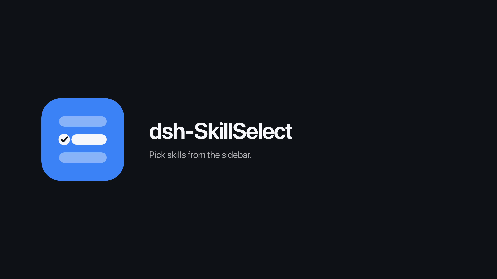
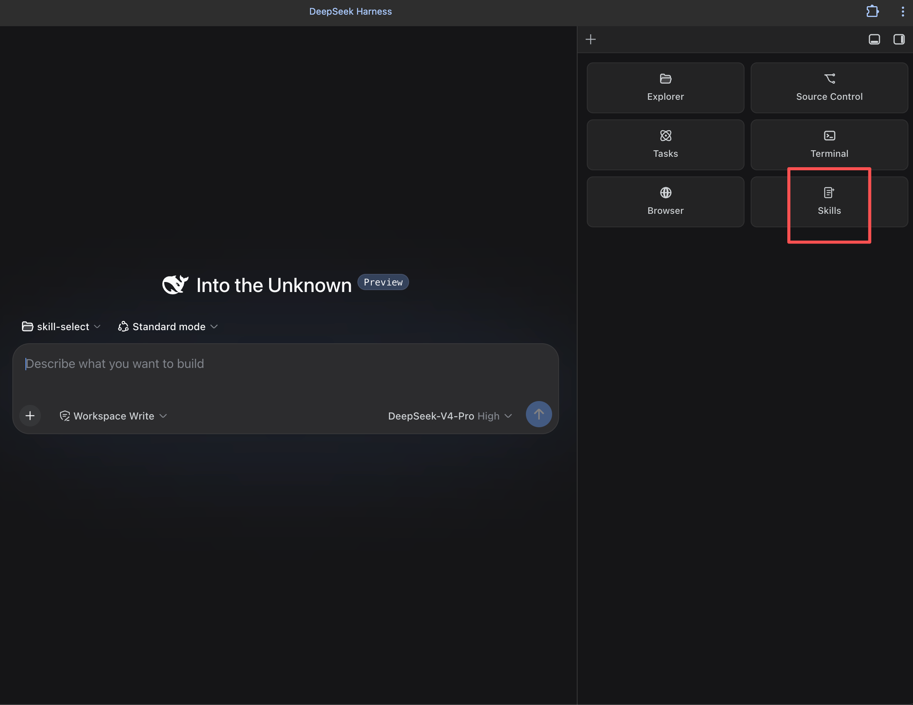

<p align="center">
  
</p>

# dsh-SkillSelect

[English](README.md) · 中文

DSH Web 插件：在侧边栏勾选已安装的 skill，并注入当前会话。

## 功能

- 列出全部已配置 skill。标注 **Global**，能推断时显示所属 **repo**。
- **Skills**：本会话勾选。单项写入 `/skill-name`；整 repo 勾满写入 `/repo`，发送时展开。重新打开侧边栏会清空本页。
- **Auto-start**：常驻默认启动名单，每个会话首条消息注入一次。勾选方式与 Skills 相同。
- 排序：**Repo**（默认）/ **Name** / **Most used** / **Source**。Repo 与 Source 按组折叠。
- **Guard**（默认关）：打开后，模型经 `skill` 工具调用不在「默认启动 ∪ 本会话勾选」内的技能会被拒绝。手动 `/skill` 不受限。
- 有 frontmatter `description` 则直接用；否则生成一句英文简介并缓存。不改任何 skill 文件。
- 同时列出 Codex / Grok / Hermes 用户技能（跳过内置）。重名分列。勾选写入 `/name@agent`，由插件注入对应来源的 `SKILL.md`。不注册进模型的 `available_skills`。
- **Update**：对 git 仓库执行 `git pull`，对技能目录内来源标记重拉；根级标记与无来源为 skipped。变更摘要显示在面板内。

## 安装

仅 web profile。

```bash
# 本地开发请用 link:，改代码重启即生效
dsh plugin --profile web add "link:/path/to/skill-select"

# 从 GitHub 安装
dsh plugin --profile web add "github:<you>/dsh-skill-select#main"
```

重启 `dsh web`，然后硬刷新浏览器（`Cmd/Ctrl+Shift+R`）。

## 侧边栏兼容

本仓库不附带其他侧边栏。

已安装 [dsh-better-sidebar](https://github.com/omdsh-dev/DSH-better-sidebar) 时，注册为其 **Skills** 页签（`ctx.betterSidebar.registerTab`）。打开 Side Card，在 `+` 菜单选择 **Skills**。



未安装或已禁用 [dsh-better-sidebar](https://github.com/omdsh-dev/DSH-better-sidebar) 时，自绘右侧栏并顶替同一位置：开关在 **Session log** 右侧，布局用 `#root { margin-right }`，点击面板外关闭。

强制使用自绘侧边栏：

```yaml
# ~/.dsh/profiles/web/cordis.patch.yml
- { id: better-sidebar, disabled: true }
```

## 开发

```bash
node --test
node --check lib/index.js && node --check lib/client.js
```

设计文档：[`docs/design.md`](docs/design.md)。
