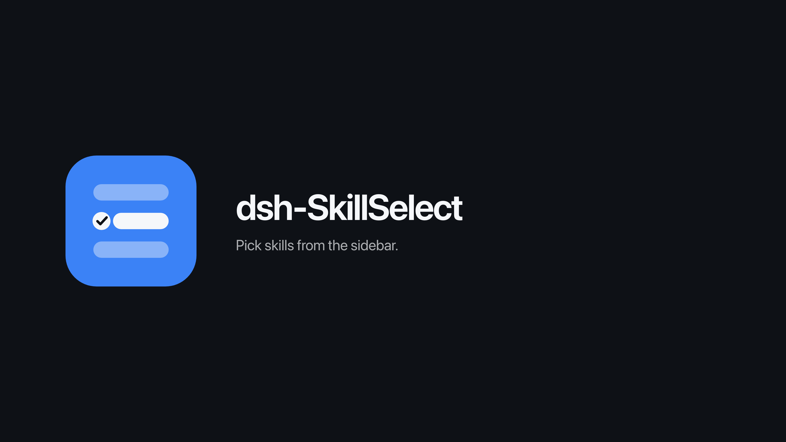

<p align="center">
  
</p>

# dsh-SkillSelect

[English](README.md) · 中文

DSH Web 插件：在官方右侧栏页签中勾选已安装的 skill，并注入当前会话。

## 功能

- 列出全部已配置 skill。标注 **Global**，能推断时显示所属 **repo**。
- **Skills**：本会话勾选。单项写入 `/skill-name`；整 repo 勾满写入 `/repo`，发送时展开。页签隐藏后重新打开会清空本会话勾选。
- **Auto-start**：常驻默认启动名单，每个会话首条消息注入一次。勾选方式与 Skills 相同。
- 排序：**Repo**（默认）/ **Name** / **Most used** / **Source**。Repo 与 Source 按组折叠。
- **Guard**（默认关）：打开后，模型经 `skill` 工具调用不在「默认启动 ∪ 本会话勾选」内的技能会被拒绝。手动 `/skill` 不受限。
- 有 frontmatter `description` 则直接用；否则生成一句英文简介并缓存。不改任何 skill 文件。
- 同时列出 Codex / Grok / Hermes 用户技能（跳过内置）。重名分列。勾选写入 `/name@agent`，由插件注入对应来源的 `SKILL.md`。不注册进模型的 `available_skills`。
- **Update**：对 git 仓库执行 `git pull`，对技能目录内来源标记重拉；根级标记与无来源为 skipped。变更摘要显示在面板内。

## 安装

仅 web profile。

```bash
dsh plugin --profile web add "github:wyzh0117/dsh-skill-select#main"

# 本地开发请用 link:，改代码重启即生效
# dsh plugin --profile web add "link:/path/to/skill-select"
```

重启 `dsh web`，然后硬刷新浏览器（`Cmd/Ctrl+Shift+R`）。

## DSH 版本兼容

| 插件版本 | 支持的 DSH | 说明 |
|---|---|---|
| **0.2.0**（当前） | `^0.2.0-rc.2` | 注册进官方右侧栏（见下）。 |
| 0.1.1 | `^0.1.0-rc.6 \|\| ^0.1.5-rc.1` | 0.1.x 两条线的最后一版；在 0.2.x 上会被下面的 peer 门禁静默跳过。 |
| 0.1.0 | `^0.1.0-rc.6` | **在 0.1.5+ 上不可用**，见下。 |

**dsh 0.2.0-rc.2 起有硬兼容门禁**：`dsh-app-boot` 读取 `package.json`
`peerDependencies` 里名字为 `@deepseek-ai/dsh` 或以 `@deepseek-ai/dsh-` 开头的
条目，逐条执行 `semver.satisfies(runtimeVersion, range, { includePrerelease: true })`，
任一不满足就**整棵 bundle 跳过**——模块根本不会被 import，插件行直接显示禁用，
且没有任何报错。**插件在升级 DSH 后静默消失时，第一步就对照 `dsh --version`
检查这些 peer 范围。** `dsh.plugin.json` 的 `engines.dsh` 在 rc.2 不参与判定
（仅当元数据保留）。确需强行加载时的逃生门：`dsh plugin allow-version`，
写入 `<profile>/compatibility.json`。

**rc.2 还把「读会话」拆成了冷、活两条路。** `ctx.sessions` 现在只是一个装着
**活会话**的内存 store：`sessions.get(id)` 只对本进程激活过的会话作答。你只是在
网页端打开过的会话是**冷会话**，所以旧的单路径代码会对屏幕上明明存在的每个会话
报 `session "…" not found`（404）。`openSkillView()` 两条路都覆盖：活会话直接
当 scope，注册表由 `ctx.agentPresets.serviceFor(agent, "skills")` 取；冷会话用
`ctx.sessionQuery.observeSession(id, { projectionMode })` 读
`header.cwd` 与 `projections.values.agentPreset`，再向
`ctx.agentPresets.acquireScope(preset)` 要一个**常驻** scope——因为给一个从未
进入本进程的会话列技能同样需要一个 scope。每个句柄都在 `finally` 里释放
（`Symbol.dispose` / `Symbol.asyncDispose`），scope 不还会把 preset 注册表钉在
内存里。`SESSION_QUERY_SESSION_NOT_FOUND` 映射 404，其余查询错误映射 500；
没有 `sessionQuery` 的宿主退回 `sessions.get()`。**要记住的症状**：接口 200 但
`skills: []`，而同一个会话里模型明显能用上技能，就是冷路径没拿到 scope——通常因为
profile 里某条 `@deepseek-ai/dsh-*` 被版本门禁跳过，而 `acquireScope` 会牵动
shell / sandbox / tool 整条依赖链，那条链一断它就抛错。

DSH 0.1.5 改了 client 模块表：`@deepseek-ai/dsh-client-runtime` 不再是种子包，
`require("@deepseek-ai/dsh-client-runtime")` 会抛 `missed the module table`，
页面报 **Failed to load plugins**（宿主本身能起来）。0.1.1 改用
`ctx.sessions.scope(sessionId)`，并在 `dsh.plugin.json` / `peerDependencies`
里声明支持 0.1.5。client 代码只能 `require()` 平台种子包——侧栏图标因此
必须是内联 SVG 组件。

**升级 DSH 后必做**：`dsh` 只升了 CLI，profile 里已安装的插件仍停在旧 API，
需要重新解析一次：

```bash
dsh plugin --profile web update     # 重新解析 github:/registry 安装的插件
# link:/ 本地目录是就地使用，重启 dsh web 即可
```

再在本仓库跑 `npm test`：`tests/dsh-compat.test.js` 会在 DSH 删掉某个 named
export、砍掉某个 client 种子包、或某个 `@deepseek-ai/dsh-*` peer 范围不再覆盖
本机运行时版本时直接失败，不必等宿主/页面炸掉才发现。

## 侧栏

插件以**两阶段注册**接入 dsh 官方右侧栏（dsh ≥ 0.2），两阶段都必须正确：

1. **页面类型** —— `ctx.sidebarRightTabs.register({ id: "dsh-skill-select", kind: "skill-select", priority: "extension", title: () => "Skills", guide: [{ id: "dsh-skill-select", order: 70, /* … */ icon: SkillIcon }] })`。
   `kind` 是 `ctx.sidebarRight.openTab(kind)` 用的判别式；`guide` 条目决定
   右侧栏 guide 页上是否出现 **Skills** 入口。`guide[].id` 必填——两个都省略
   `id` 的 guide 条目会抛 "duplicate guide entry id"。
2. **keyed 插槽** —— 主体用 `ctx.slots.register({ name: "sidebar.right.pane.tab", key: "dsh-skill-select", inject: () => ({ rootCtx: ctx }) }, SkillSelectTab)`，
   胶囊标题用 `sidebar.right.pane.tab.title`。插槽 `key` 必须等于阶段一的
   **id**（不是 kind）；给 keyed 插槽挂 list 形的 `{id, order}` 属于注册失败。
   两处注册都包在 `ctx.effect(...)` 里，并经 `ctx.slots.inject(slotName, cb)`
   兜住加载顺序。

打开右侧栏，在 guide 页点 **Skills**。`ctx.sidebarRight.openTab("skill-select")`
总会展开侧栏，且画面内没有 Session 时抛错。页签主体拿到 `sessionId` 与
`useTabInfo()`，按 `tab.visible` 门控技能拉取，并在隐藏→重新显示时重置本会话
勾选。

不依赖第三方侧边栏，也没有自绘回退 UI：官方侧栏不在，就没有页签。

## 开发

```bash
node --test
node --check lib/index.js && node --check lib/client.js
```

设计文档：[`docs/design.md`](docs/design.md)。
